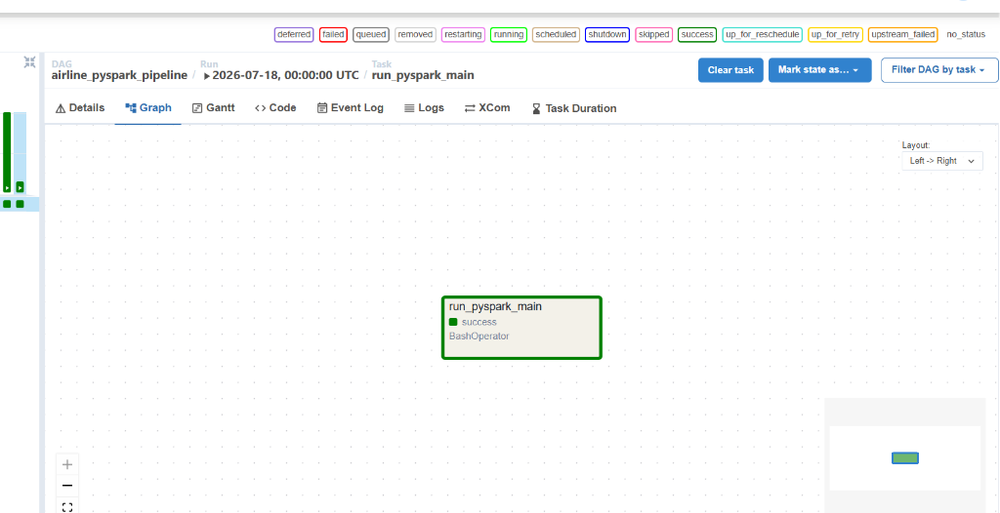
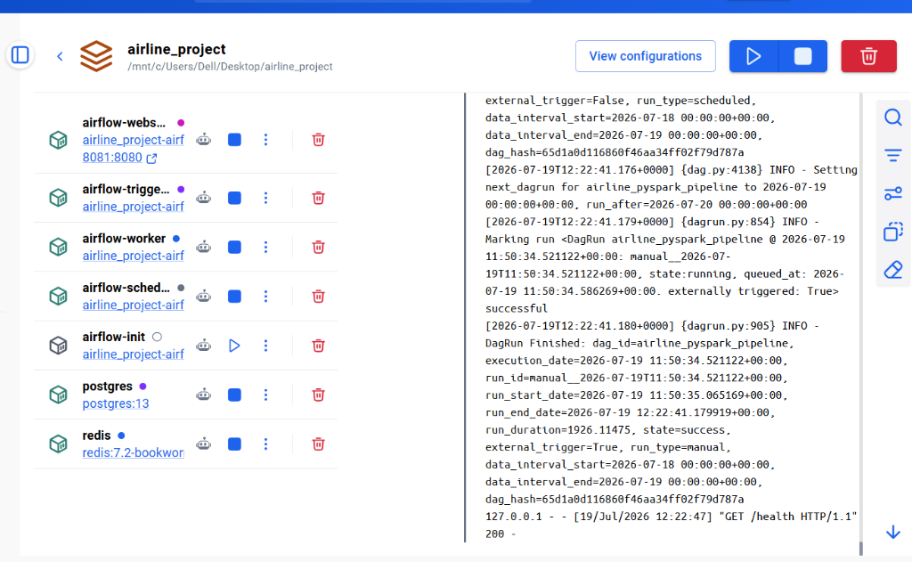
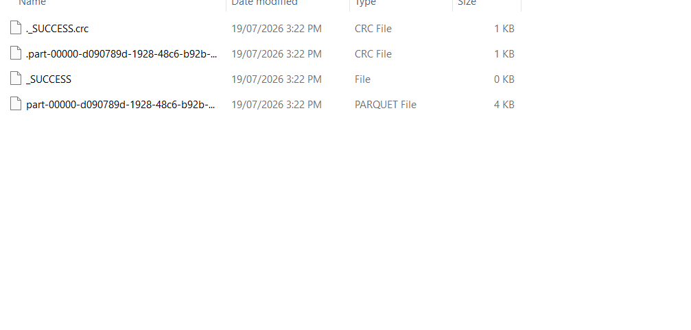

# ✈️ Airline Flight Data Pipeline (Data Engineering Portfolio Project)

## 📌 Project Overview
This is a Data Engineering pipeline that extracts airline and flight data, performs complex transformations and joins, and loads the cleaned data into a Data Lake (Parquet format) for analytics. 
The entire pipeline is orchestrated using **Apache Airflow**, processed using **Apache Spark (PySpark)**, and containerized using **Docker** for complete reproducibility.

## 🏗️ Architecture & Tech Stack
- **Data Processing:** Apache Spark (PySpark)
- **Orchestration:** Apache Airflow
- **Infrastructure:** Docker & Docker Compose
- **Language:** Python 3.12
- **Storage:** Local System (Parquet Files)

## 🗂️ Data Sources
The pipeline processes raw CSV files containing:
1. `flights.csv`: Massive dataset of individual flights, delays, and routes.
2. `airlines.csv`: Dimension table mapping airline codes to full names.
3. `airports.csv`: Dimension table mapping airport IATA codes to city and geographical data.

## 🚀 Pipeline Workflow (ETL)
1. **Extract (`src/extract.py`):** Reads the raw CSV datasets into Spark DataFrames.
2. **Transform (`src/transform.py`):**
   - Handles missing values (NULLs) in critical delay columns.
   - Cleans airport codes.
   - Denormalizes the data by joining the fact table (`flights`) with dimension tables (`airlines`, `airports`).
   - Calculates custom metrics (e.g., `TOTAL_DELAY`).
3. **Load (`src/load.py`):** Writes the final cleaned dataset into a `data/gold/` folder in highly optimized **Parquet** format.
4. **Orchestrate (`dags/airline_dag.py`):** Airflow triggers this process automatically on a daily schedule.

## 📸 Project Execution Proof

### 1. Airflow DAG Success
The pipeline ran successfully in Apache Airflow, completing all tasks.


### 2. Docker Containers
All infrastructure components running smoothly in Docker Desktop.


### 3. PySpark Output (Parquet)
The processed gold dataset partitioned into Parquet files.


## ⚙️ How to Run Locally

### Prerequisites
- Docker & Docker Compose installed.

### Steps
1. Clone the repository:
   ```bash
   git clone https://github.com/YOUR_USERNAME/airline-data-pipeline.git
   cd airline-data-pipeline
   ```
2. Initialize Airflow Database:
   ```bash
   docker compose up airflow-init
   ```
3. Start the Pipeline:
   ```bash
   docker compose up -d
   ```
4. Access the Airflow UI:
   Open your browser and navigate to `http://localhost:8081` (Username: `airflow`, Password: `airflow`).
5. Trigger the DAG:
   Turn on `airline_pyspark_pipeline` and trigger it manually to watch the data process!

## 💡 Engineering Decisions & Challenges
- **Custom Docker Image:** The official Airflow image does not include Java or PySpark. A custom `Dockerfile` was built to install `openjdk-17-jre-headless` and `pyspark==3.5.1` inside the Airflow environment.
- **Volume Mapping:** To allow Airflow to execute local scripts and read local data, the entire project directory is volume-mounted into the Docker container as `/opt/airflow/project`.
- **Handling Join Ambiguity:** Resolved `AMBIGUOUS_REFERENCE` errors during PySpark joins by pre-renaming dimension columns (`AIRLINE` to `AIRLINE_NAME`) before the join operation.
